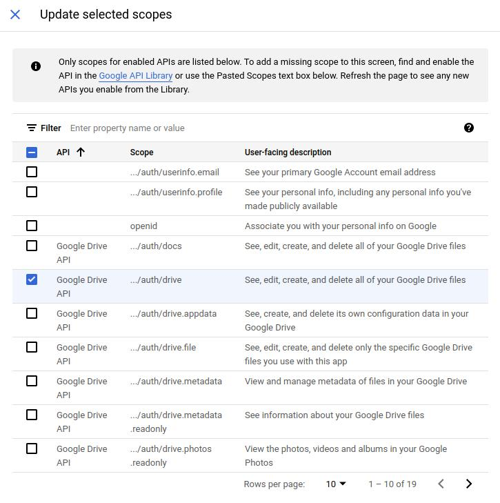
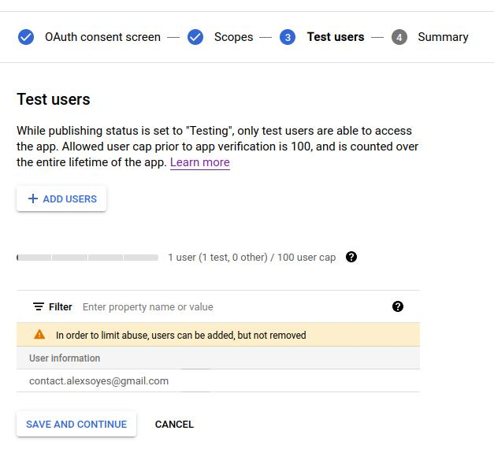

# PHP Google Drive backup

A (very) simple CLI tool that I used to backup my www directory and my database from OVH to Google Drive, in a cronjob.

⚠️**You should never trust a script found on GitHub to backup your data!** 🔥

## Getting started 🔧

You need to configure your Google Cloud Console account first.

* Create a new project and an OAuth from [quickstart](https://developers.google.com/drive/api/v3/quickstart/php#step_1_turn_on_the).
  * Download the `credentials.json`.
  * Upload it in the root directory of this project.
* Activate [Google Drive API](https://console.cloud.google.com/apis/credentials/consent/edit?folder=&hl=fr&organizationId=&project=your-project).
  * Go to "OAuth authorization screen" and edit application.
  * Enable field `.../auth/drive` in order to create/remove some files.
  
* Add a test user with the email you wish to use.
  
* ❌ **Do not activate the "production review" since:**
  * You do not need it.
  * It will make you unable to continue the process.
* Then, generate the proper `token.json` file by logging with the given URL.
* All good! ✅

## Environments variables 🚀

The following environment variables must be declared.

If you do not know how it works, just create a file named `.env.local` in the root directory with your own configuration.

(The `.env.dist` file contains a skeleton.)

Example:

```dotenv
DB_HOST=127.0.0.1
DB_USER=username
DB_PASSWORD=password
DB_NAME=database_name
DB_PORT=3306
DIRECTORY_TO_BACKUP=www
DELETE_UPLOADED_BACKUPS=false
ONLY_CLI=false
```

Feel free to file it with your data!

## Launching cronjob from OVH to Google Drive

Here is my cronjob configuration.

* I decided to run the job the first and the fifteenth of each month: `0 0 1,15 * *`
* Log are sent by email
* All good! ✅

## Developer resources 📝

* [Google Quickstart with Google Drive API in PHP](https://developers.google.com/drive/api/v3/quickstart/php).
* Documentation & examples [googleapis/google-api-php-client](https://github.com/googleapis/google-api-php-client) (used by this project).
  * [API documentation](https://developers.google.com/resources/api-libraries/documentation/drive/v3/php/latest/index%2Ehtml) (for old school developers 💪).
  